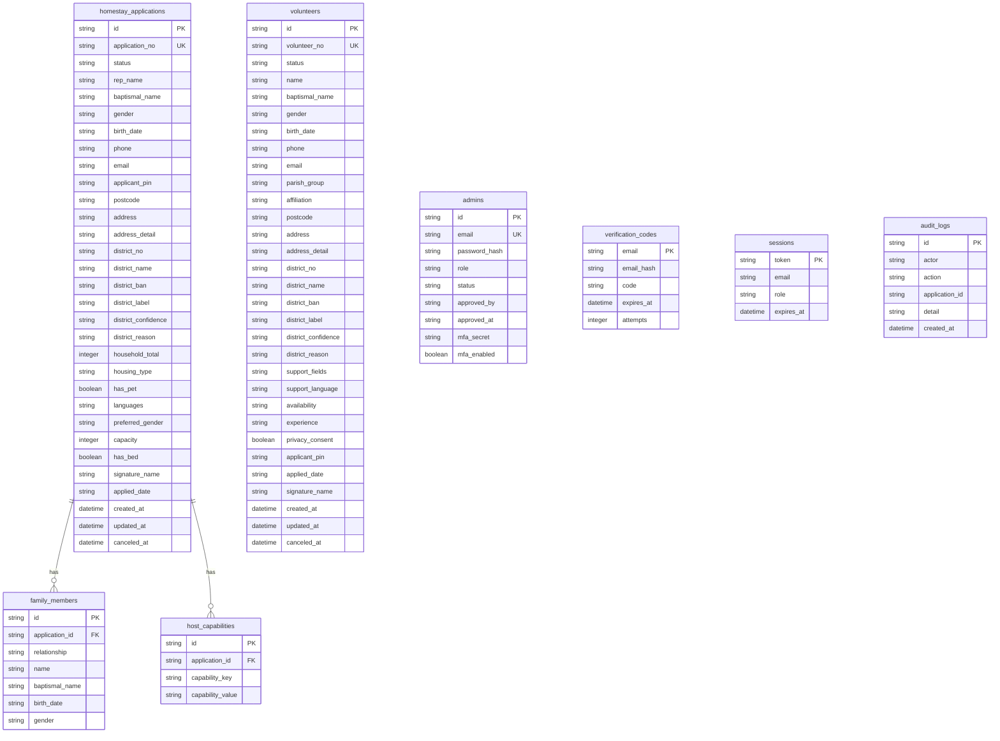

# 데이터베이스 운영 사양서

이 문서는 2027 서울 WYD 세곡동 성당 접수 시스템의 데이터베이스 선택 기준, 초기화 절차, 테이블 구조, 개인정보 암호화, readiness, 백업 기준을 정의합니다. 운영자가 배포 전후에 확인해야 하는 DB 관련 정본 문서입니다.

## 1. 운영 결론

현재 운영 배포는 Google Cloud Run + Cloud SQL PostgreSQL입니다. Cloud Run은 컨테이너 파일 시스템이 영구 저장소가 아니므로 운영에서는 PostgreSQL을 정본 DB로 사용합니다.

동시접속 100명, 신청서 수 수천 건 수준의 로컬/단일 VM 운영은 SQLite로 충분합니다. 다만 앱 서버를 2대 이상으로 늘리거나 Cloud Run, App Runner, ECS, EKS처럼 컨테이너가 여러 개 뜨는 구조에서는 PostgreSQL을 사용해야 합니다.

| 운영 형태 | 권장 DB | 판단 |
| --- | --- | --- |
| 로컬 개발 | SQLite | 설정이 단순하고 파일로 확인 가능 |
| 단일 VM, Docker Compose | SQLite | 현재 예상 규모에서 충분 |
| 단일 VM이지만 장애 복구 자동화 필요 | PostgreSQL 검토 | 관리형 백업, PITR이 필요하면 전환 |
| 현재 운영 Cloud Run | PostgreSQL 필수 | Cloud SQL PostgreSQL 사용 |
| App Runner | PostgreSQL 필수 | 컨테이너 파일 시스템이 영구 저장소가 아님 |
| EKS/ECS 다중 replica | PostgreSQL 필수 | SQLite는 여러 앱 인스턴스 공유에 부적합 |
| 장기적으로 신청 5만 건 이상 | PostgreSQL 권장 | 검색, 백업, 운영 편의성 측면에서 유리 |

## 2. DB 모드 결정 방식

애플리케이션은 `DATABASE_URL` 존재 여부로 DB 모드를 결정합니다.

| 환경변수 | 동작 |
| --- | --- |
| `DATABASE_URL` 없음 | SQLite 모드 |
| `DATABASE_URL` 있음 | PostgreSQL 모드 |
| `DATABASE_SSL=true` | PostgreSQL SSL 사용 |
| `DATA_DIR` | SQLite 파일 저장 디렉터리 |

현재 운영 기준:

```text
DATABASE_URL=PostgreSQL Cloud SQL 연결 문자열
DATABASE_SSL=false
Cloud SQL instance=mystic-planet-347807:asia-northeast3:wyh-postgres
```

SQLite 기본 경로:

```text
data/wyd-homestay.sqlite
```

컨테이너 기본 경로:

```text
/app/data/wyd-homestay.sqlite
```

## 3. 초기 구축 절차

새 DB 또는 새 운영 환경에서는 앱 서버를 띄우기 전에 스키마를 먼저 생성합니다.

```bash
npm run db:setup
```

`npm run db:setup`이 수행하는 작업:

- 필수 테이블 생성
- 필수 인덱스 생성
- SQLite WAL 모드 활성화
- `INITIAL_ADMIN_EMAIL`과 `INITIAL_ADMIN_PASSWORD`가 지정된 경우에만 초기 관리자 계정 시딩
- 기존 DB에 `applicant_pin`, `email_hash`, 홈스테이/자원봉사자 `district_*`, 관리자 승인 관련 컬럼이 없으면 보수 마이그레이션

저장소에는 기본 관리자 비밀번호를 두지 않습니다. 운영에서는 개별 운영자 계정을 명시적으로 생성하고 MFA 등록을 완료합니다.

관리자 계정 추가:

```bash
node scripts/create-admin.mjs operator@example.org StrongPassword123! admin
node scripts/create-admin.mjs privacy@example.org StrongPassword123! privacy_admin
```

## 4. 서버 기동 시 DB 검사

서버 시작 시 `initDb()`는 전체 스키마를 새로 만들지 않고 다음 검사를 수행합니다.

| 단계 | 검사 내용 | 실패 시 |
| --- | --- | --- |
| 1 | DB 연결성 확인 `SELECT 1` | 서버 시작 중단 |
| 2 | `admins` 테이블 존재 확인 | `npm run db:setup` 실행 안내 후 중단 |
| 3 | `verification_codes.email_hash`, 홈스테이/자원봉사자 `district_*` 보수 마이그레이션 | 컬럼 또는 인덱스 생성 |

`/api/ready`는 실행 중인 서버의 DB 연결 상태를 점검합니다. Kubernetes readiness probe, Docker healthcheck, 로드밸런서 상태 확인에 사용합니다.

## 5. 테이블 목록

| 테이블 | 목적 | 주요 개인정보 |
| --- | --- | --- |
| `admins` | 관리자 계정, 역할, MFA secret | 이메일 |
| `homestay_applications` | 홈스테이 호스트 신청서 | 성명, 세례명, 생년월일, 연락처, 이메일, 주소, 서명 |
| `family_members` | 호스트 가족 구성원 | 성명, 세례명, 생년월일 |
| `host_capabilities` | 매칭 검색용 호스트 조건 | 없음 |
| `volunteers` | 자원봉사자 신청서 | 성명, 세례명, 생년월일, 연락처, 이메일, 구역, 소속 단체, 주소, 서명 |
| `verification_codes` | 이메일/SMS 인증번호 | 이메일 해시 |
| `sessions` | 신청자/관리자 세션 | 이메일 |
| `audit_logs` | 운영자 주요 행위 기록 | 행위자 식별자 |

## 6. 관계 구조



## 7. 주요 테이블 상세

### `homestay_applications`

홈스테이 호스트 신청서의 대표 테이블입니다. 접수번호, 신청 상태, 대표자 인적사항, 주소, 홈스테이 조건, 동의 및 서명 정보를 저장합니다.

주소 입력 시 구역반 편성표 기준으로 `district_no`, `district_name`, `district_ban`, `district_label`, `district_confidence`, `district_reason`을 자동 계산합니다. 현재 신규 편성표 기준 한양수자인은 `12구역`, 강남아이파크는 `8구역`으로 처리하고, 편성표에 매칭되지 않는 주소는 `99구역 = 구역외`로 저장합니다.

주요 상태값:

| 값 | 의미 |
| --- | --- |
| `submitted` | 접수됨 |
| `confirmed` | 승인 또는 확인됨 |
| `canceled` | 취소됨 |

### `family_members`

홈스테이 신청자의 가족 구성원 정보를 저장합니다. `application_id`로 `homestay_applications.id`를 참조합니다.

### `host_capabilities`

호스트 매칭 검색을 쉽게 하기 위한 key-value 테이블입니다. 가능 언어, 침대 제공 가능 여부, 반려동물 여부 같은 조건을 저장합니다.

### `volunteers`

자원봉사자 신청서를 저장합니다. 희망 봉사 분야는 `support_fields`에 문자열 목록 형태로 저장하고, 외국어 지원 언어는 `support_language`에 쉼표 구분 문자열로 저장합니다. 신청자가 입력한 구역과 소속 단체는 각각 `parish_group`, `affiliation`에 저장합니다.

홈스테이 신청과 동일하게 주소 입력 시 구역반 편성표 기준으로 `district_no`, `district_name`, `district_ban`, `district_label`, `district_confidence`, `district_reason`을 자동 계산해 저장합니다. 신청 화면에서 운영자가 수동 설정한 경우 `district_confidence`는 `manual`로 저장되며, 이후 조회와 엑셀 다운로드는 저장된 값을 우선 사용합니다.

### `verification_codes`

신청자 인증번호를 저장합니다. 이메일 평문 조회 대신 `email_hash`를 사용합니다. 인증번호는 만료 시간이 있고 성공 검증 후 삭제됩니다.

### `admins`

운영자 계정을 저장합니다. 비밀번호는 PBKDF2-SHA512 210,000회 해시로 저장하고, 기존 1,000회 해시 계정은 로그인 호환성을 유지합니다. TOTP MFA를 위한 `mfa_secret`을 보관합니다. MFA는 원본 개인정보에 접근 가능한 `privacy_admin`, `super_admin`에게 필수이고, 마스킹/가명 정보만 보는 일반 `admin`에게는 필수가 아닙니다.

역할과 승인 상태:

| 컬럼 | 의미 |
| --- | --- |
| `role` | `admin`, `privacy_admin`, `super_admin` |
| `status` | `pending`, `approved`, `rejected` |
| `approved_by` | 승인 또는 변경 처리자 |
| `approved_at` | 승인 또는 변경 시각 |

`brotheroak@gmail.com`, `livelab21@nate.com`은 애플리케이션에서 고정 최고 관리자로 취급되며 다른 운영자가 권한을 낮출 수 없습니다.

## 8. 개인정보 암호화

운영 모드에서는 `DATA_ENCRYPTION_KEY`가 필수입니다. 키가 없으면 서버가 시작되지 않습니다.

암호화 방식:

```text
AES-256-GCM
```

암호화 저장값 접두사:

```text
enc:v1:
```

암호화 대상:

| 테이블 | 컬럼 |
| --- | --- |
| `homestay_applications` | `rep_name`, `baptismal_name`, `phone`, `email`, `address`, `address_detail`, `signature_name` |
| `family_members` | `name`, `baptismal_name` |
| `volunteers` | `name`, `baptismal_name`, `phone`, `email`, `parish_group`, `affiliation`, `address`, `address_detail`, `signature_name` |
| `sessions` | `email` |
| `audit_logs` | `actor` |

주의:

- `DATA_ENCRYPTION_KEY`를 바꾸면 기존 암호화 개인정보를 복호화할 수 없습니다.
- 운영 시작 후 키 교체가 필요하면 별도의 재암호화 절차가 필요합니다.
- 개발 환경에서 `encryption:false`가 나올 수 있지만 운영에서는 허용하지 않습니다.

## 9. 검색과 인덱스 정책

현재 주요 개인정보가 암호화되므로 이름, 연락처, 이메일 검색은 DB `LIKE`로 직접 처리하지 않습니다. 서버가 후보 데이터를 읽고 복호화한 뒤 필터링합니다.

현재 규모 판단:

| 데이터 규모 | 현재 방식 |
| --- | --- |
| 신청 수 수백 건 | 문제 없음 |
| 신청 수 수천 건 | 허용 가능 |
| 신청 수 수만 건 | 검색 성능 개선 필요 |

향후 개선안:

- 성명, 전화번호, 이메일의 정규화 해시 컬럼 추가
- 관리자 목록 페이지네이션 추가
- PostgreSQL 전환 후 상태, 접수일, 해시 컬럼 중심 인덱스 운영

현재 생성되는 주요 인덱스:

| 인덱스 | 대상 |
| --- | --- |
| `idx_homestay_applications_email` | `homestay_applications.email` |
| `idx_homestay_applications_lookup` | `homestay_applications.rep_name`, `homestay_applications.phone` |
| `idx_homestay_applications_status` | `homestay_applications.status` |
| `idx_homestay_applications_district` | `homestay_applications.district_no`, `homestay_applications.district_ban` |
| `idx_capabilities_lookup` | `host_capabilities.capability_key`, `host_capabilities.capability_value` |
| `idx_volunteers_status` | `volunteers.status` |
| `idx_volunteers_lookup` | `volunteers.name`, `volunteers.phone` |
| `idx_volunteers_district` | `volunteers.district_no`, `volunteers.district_ban` |
| `idx_verification_codes_email_hash` | `verification_codes.email_hash` |

암호화가 켜진 운영 환경에서는 일부 개인정보 인덱스의 검색 효율이 제한됩니다. 이 인덱스들은 개발, 과거 평문 데이터, 상태 필터링, 구조적 호환성을 위한 성격이 강합니다.

## 10. 백업 기준

### SQLite

백업 대상:

- `wyd-homestay.sqlite`
- `wyd-homestay.sqlite-wal`
- `wyd-homestay.sqlite-shm`

권장 주기:

| 기간 | 주기 |
| --- | --- |
| 평시 | 매일 1회 |
| 접수 집중 기간 | 6시간 1회 |
| 행사 종료 후 | 암호화 보관본 별도 생성 |

복구 시에는 세 파일을 같은 시점 기준으로 복원합니다. WAL 모드이므로 `.sqlite` 파일만 복사하는 백업은 최신 트랜잭션을 잃을 수 있습니다.

### PostgreSQL

운영 권장:

- 자동 백업 7일 이상
- 행사 기간 PITR 활성화
- 행사 종료 후 장기 보관 스냅샷 생성
- 복구 리허설 1회 이상 수행

## 11. Readiness와 상태 확인

| API | 목적 | 정상 기준 |
| --- | --- | --- |
| `/api/health` | Node.js 프로세스 생존 확인 | `200 OK` |
| `/api/ready` | DB 연결 및 운영 상태 확인 | `200 OK`, `db:"ready"` |
| `/api/funnel/status` | 동시 처리 제한 상태 확인 | available slot 확인 |

`/api/ready` 예시:

```json
{
  "ok": true,
  "db": "ready",
  "encryption": true,
  "notifications": {
    "email": true,
    "sms": false
  },
  "time": "2026-07-04T00:00:00.000Z"
}
```

운영 환경 확인 기준:

- `ok`는 `true`
- `db`는 `ready`
- `encryption`은 `true`
- `notifications.email` 또는 `notifications.sms` 중 실제 발송 채널이 `true`

## 12. 운영 체크리스트

- 새 환경에서 `npm run db:setup`을 먼저 실행했다.
- `/api/ready`가 `200 OK`를 반환한다.
- 운영에서는 `encryption:true`를 확인했다.
- SQLite 운영 시 DB 파일 3종 백업을 설정했다.
- PostgreSQL 운영 시 자동 백업과 PITR을 설정했다.
- 관리자 계정은 개별 계정으로 만들었고 MFA 등록을 완료했다.
- 신청 시작 전 테스트 신청, 관리자 조회, 감사 로그 다운로드를 확인했다.
