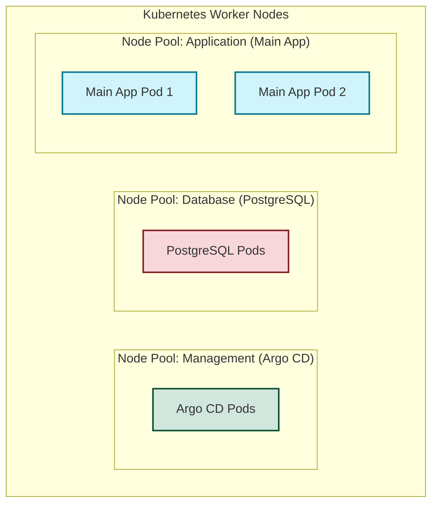

# Kubernetes 멀티 노드 아일랜드 아키텍처 가이드 (App, DB, Argo CD 노드 분리)

Kubernetes(EKS, GKE 등) 클러스터 운영 시 **애플리케이션 노드(Main App)**, **데이터베이스 노드(PostgreSQL)**, 그리고 **배포/관리 노드(Argo CD)**를 물리적/논리적으로 분리하여 가동하는 것은 엔터프라이즈 환경의 필수적인 권장 아키텍처입니다.

이 문서에서는 노드를 분리해야 하는 아키텍처적 당위성(이유)과 이를 쿠버네티스 명세(Manifest)로 구현하는 방법을 구체적인 예제와 함께 설명합니다.

---

## 1. 노드 분리의 핵심 장점 (Why?)



### ① 자원 격리 및 성능 안정성 (Resource Isolation)
- **PostgreSQL**: 디스크 I/O와 메모리 소비가 극심하며 대규모 트래픽 시 버스트가 발생합니다.
- **Main App**: 웹 요청 증가 시 HPA(Horizontal Pod Autoscaler)에 의해 동적으로 Scale-Out/In을 반복합니다.
- **격리하지 않을 시**: 애플리케이션 Pod가 급증하여 노드의 CPU/메모리를 고갈시키면, 데이터베이스 엔진이 커널에 의해 OOM(Out of Memory) Kill 되거나 디스크 I/O 병목으로 전체 서비스가 중단되는 대형 장애가 발생할 수 있습니다.

### ② 보안 수준 강화 (Security Blast Radius Limitation)
- **Argo CD**: 클러스터 전체 리소스를 제어하는 관리자 권한(`ClusterAdmin` 권한의 ServiceAccount)을 가집니다.
- **격리하지 않을 시**: 만약 인터넷에 노출된 Main App 웹 애플리케이션에 취약점(RCE 등)이 발생하여 공격자가 컨테이너를 탈취했을 때, 같은 노드에 위치한 Argo CD나 DB Pod의 파일시스템, 메모리 영역, 혹은 네트워크 볼륨에 접근(Container Escape)할 수 있는 위험 영역(Blast Radius)이 넓어집니다. 

### ③ 비용 및 하드웨어 사양 최적화 (Cost & Instance Type Matching)
노드 그룹을 다르게 가져가면 컨테이너 요구사항에 맞는 가장 최적화된 가성비의 클라우드 인스턴스 사양을 각각 매핑할 수 있습니다.

| 노드 그룹 (Node Pool) | 주 역할 | 권장 인스턴스 (AWS 예시) | 특징 |
| :--- | :--- | :--- | :--- |
| **Management** | Argo CD, Prometheus 등 운영 도구 | `m6g.large` (범용) | 중등도 CPU 및 메모리, 안정적 유지 |
| **Database** | PostgreSQL StatefulSet | `r6g.xlarge` (메모리 최적화) | 높은 메모리/Storage 속도 보장 (GP3/io2 볼륨 매핑) |
| **Application** | `wyd-homestay` 웹 서버 Pods | `c6g.medium` or **Spot Instance** | 가벼운 인스턴스, Spot 인스턴스로 70% 이상 비용 절감 가능 |

---

## 2. Kubernetes 구현 명세 (Node Selector, Taints, Tolerations)

이 구조를 쿠버네티스 클러스터에서 실현하려면 **Labeling(라벨링)**, **Taints & Tolerations(흠집과 용인)**, **Node Affinity(노드 친화성)** 기법을 조합하여 설정해야 합니다.

### ① 데이터베이스 전용 노드 설정 (Tainted Node)
데이터베이스 노드에는 일반 애플리케이션 Pod가 절대로 스케줄링되지 않도록 노드 자체에 **Taint(흠집)**를 지정합니다.

```bash
# DB 노드 그룹의 노드들에 Taint 및 Label 추가
kubectl taint nodes <db-node-name> role=db:NoSchedule
kubectl label nodes <db-node-name> role=db
```

#### PostgreSQL Deployment / StatefulSet 설정 예시
DB 노드에서만 실행되도록 허용하고 유도하기 위해 `tolerations`와 `nodeSelector`를 추가합니다.

```yaml
apiVersion: apps/v1
kind: StatefulSet
metadata:
  name: postgresql
  namespace: database
spec:
  template:
    spec:
      # 1. 오직 role=db Taint가 걸려있는 노드에 들어갈 수 있도록 허용 (용인)
      tolerations:
        - key: "role"
          operator: "Equal"
          value: "db"
          effect: "NoSchedule"
      # 2. 강제로 role=db 라벨을 가진 노드로 스케줄링되도록 지정
      nodeSelector:
        role: db
      containers:
        - name: postgresql
          image: postgres:16-alpine
          # ... 생략
```

---

### ② Argo CD (관리 도구) 전용 노드 설정
관리 서버 역시 보안 강화를 위해 전용 노드에서만 구동되도록 관리 노드 풀을 격리합니다.

```bash
kubectl taint nodes <mgmt-node-name> role=management:NoSchedule
kubectl label nodes <mgmt-node-name> role=management
```

#### Argo CD Application Controller Pod 설정 예시
```yaml
apiVersion: apps/v1
kind: Deployment
metadata:
  name: argocd-application-controller
  namespace: argocd
spec:
  template:
    spec:
      tolerations:
        - key: "role"
          operator: "Equal"
          value: "management"
          effect: "NoSchedule"
      nodeSelector:
        role: management
      # ... 생략
```

---

### ③ 메인 애플리케이션 노드 설정 (Main App Node)
일반 앱 서비스들은 위의 Taint가 없기 때문에 DB나 관리자 노드에 들어가지 못하고, 비용이 저렴하거나 Auto-Scaling이 활성화된 `role=app` 라벨이 붙은 범용/Spot 노드로 유입되도록 명시합니다.

#### [wyd-homestay.yaml](../k8s/wyd-homestay.yaml) 수정 제안 명세
```yaml
apiVersion: apps/v1
kind: Deployment
metadata:
  name: wyd-homestay
  namespace: wyd-homestay
spec:
  template:
    spec:
      # Taint가 없는 일반 애플리케이션 노드로 배포를 유도
      nodeSelector:
        role: app
      containers:
        - name: app
          image: ghcr.io/your-org/wyd-homestay-system:latest
          # ... 생략
```

---

## 3. 요약 및 권장 단계

현업에서 서비스를 안정적이고 안전하게 가동하기 위해서 노드를 **격리 및 전문화**시키는 것은 최고의 모범 사례(Best Practice)입니다.

1. **개발 및 테스트 단계**: 단일 노드(Minikube, Docker Desktop 등)에서 작동 유효성을 빠르게 테스트합니다.
2. **스테이징 및 프로덕션 단계**: 인프라 비용 절감(Spot 노드 사용) 및 고가용성 보장(DB 자원 선점 차단)을 위해 **AWS EKS 등에서 Node Group을 App, DB, Management 3개로 분리한 뒤 위 YAML 속성을 주입하여 배포**하는 것을 강력히 권장합니다.
